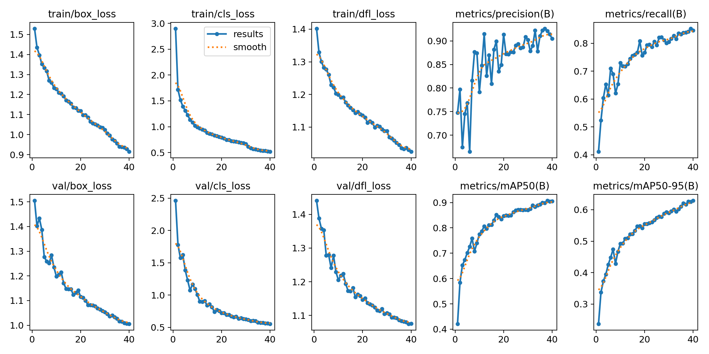
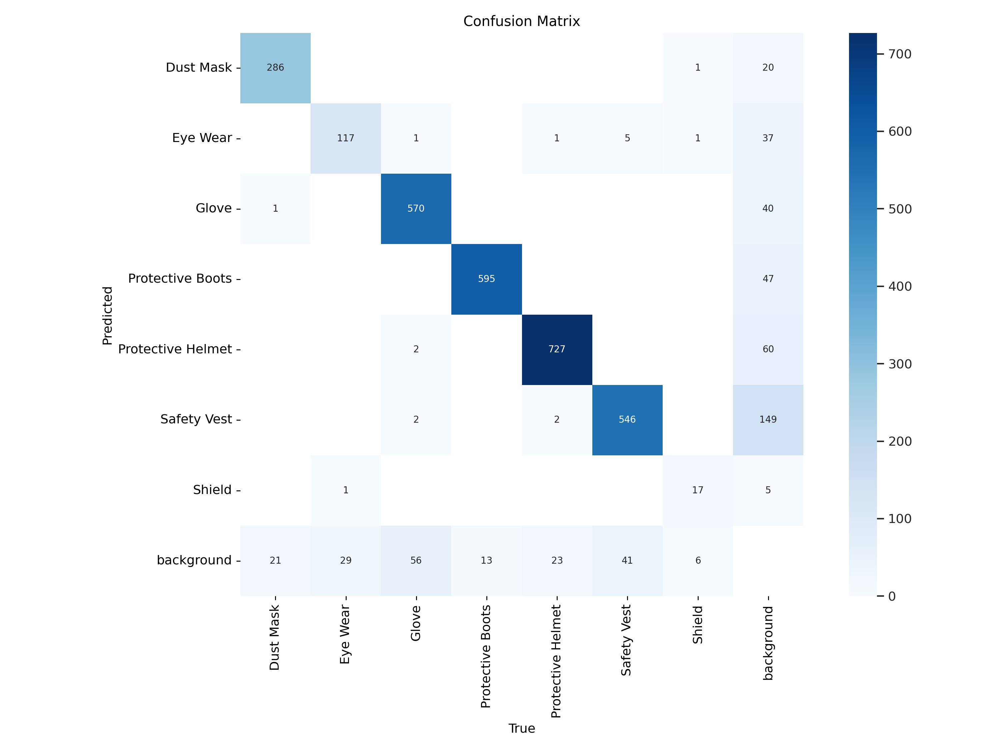
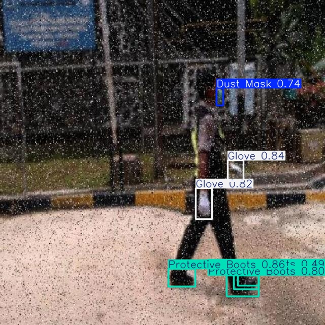

# YOLO11 Custom Object Detection for PPE Detection

This repository contains a complete implementation of training and evaluating a YOLO11 object detection model on a custom dataset for detecting Personal Protective Equipment (PPE) such as protective boots, helmets, and safety vests. The project uses the Ultralytics YOLO11 framework and is implemented in a Jupyter Notebook.

### Images
Below are key visualizations from the training and inference process:

#### Training Results

*Caption*: Plot of training metrics (precision, recall, mAP) over 40 epochs.

#### Confusion Matrix

*Caption*: Confusion matrix showing model performance across PPE classes.

#### Sample Detection

*Caption*: Example frame from `PPE_Part2.mp4` with detected PPE items (safety vests, boots, and helmets).

## Project Overview
This project demonstrates how to:
- Set up a YOLO11 environment using Ultralytics.
- Download a custom PPE detection dataset from Roboflow.
- Train a YOLO11 model on the dataset.
- Perform inference on a video to detect PPE items.
- Visualize and save the results.

The model is trained to detect three classes: **Protective Boots**, **Protective Helmets**, and **Safety Vests**.

## Features
- Custom dataset integration with Roboflow.
- Training YOLO11 on a custom PPE dataset.
- Real-time object detection on videos.
- Visualization of detection results.
- Compressed video output for easy sharing.

## Dataset
The dataset used is the **PPE Detection Dataset (Version 2)** from Roboflow, containing annotated images of workers wearing PPE. It includes three classes:

- **Protective Boots**
- **Protective Helmets**
- **Safety Vests**

## Requirements
- Python 3.8+
- NVIDIA GPU (recommended for training)
- Dependencies
